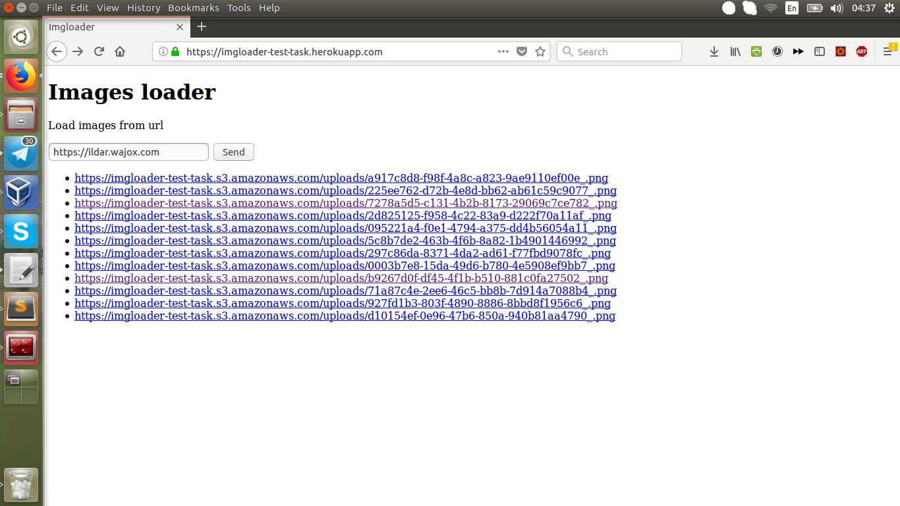

# README

[](https://travis-ci.org/ildarusmanov/imgloader)
[](https://codeclimate.com/github/ildarusmanov/imgloader/maintainability)

## Demo



[View live demo on heroku! (https://imgloader-test-task.herokuapp.com)](https://imgloader-test-task.herokuapp.com/)

## Setup
```
git clone https://github.com/ildarusmanov/imgloader.git
cd imgloader
bundle install
```

## Tests
```
rake
```

## Run

```
rails s
```